# Gadgetbridge運用   ── 天気の導入の仕方 ──
※本資料はSmart BandおよびGadgetbridgeの本質的な運用に関係しません。 しかし、UIのディテールがどうしても気になる方は参考にしていただければよいかと。

GadgetbridgeでXiaomi Smart Bandを利用するときに、天気の部分が`??`の表示になる。

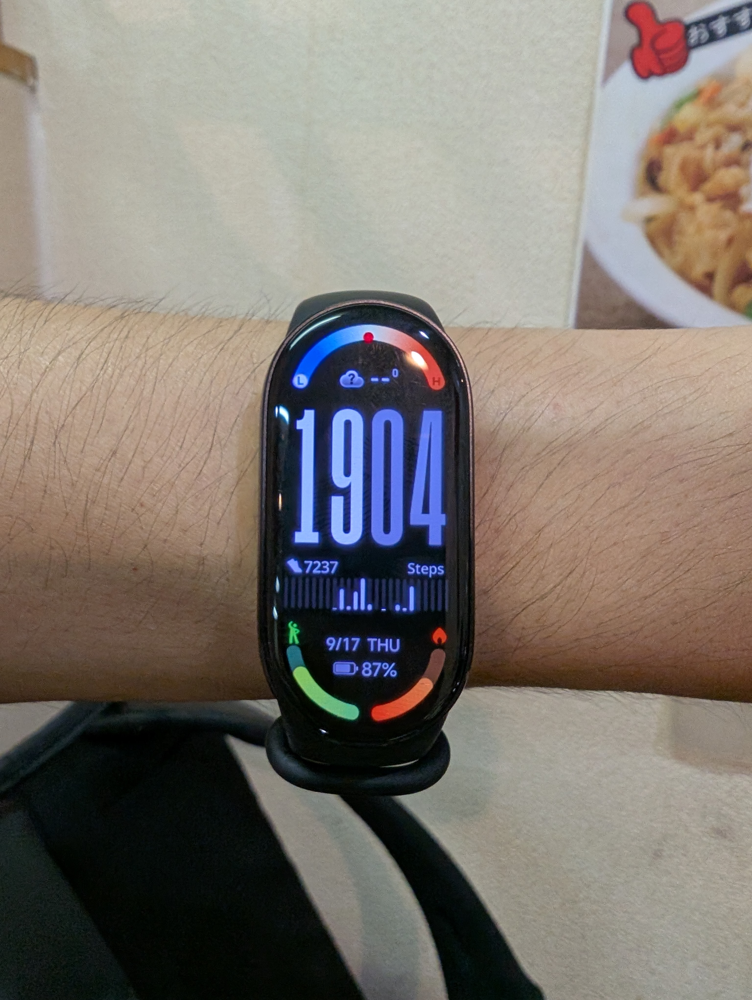

Gadgetbridgeはスマートフォンに標準搭載されている天気アプリを参照できない（っぽい）ため、表示させるためには個別で天気アプリをインストールする必要がある。

## Gadgetbridgeに対応している天気アプリ
[Gadgetbridge](https://gadgetbridge.org/)の[Weather providers](https://gadgetbridge.org/basics/integrations/weather/)にある、4つのプロバイダアプリが利用可能。
- [Tiny Weather Forecast Germany](https://f-droid.org/packages/de.kaffeemitkoffein.tinyweatherforecastgermany/)
- [QuickWeather](https://f-droid.org/packages/com.ominous.quickweather/)
- [Breezy Weather](https://apt.izzysoft.de/fdroid/index/apk/org.breezyweather/)
- [OpenWeatherProvider (LineageOS)](https://mirrorbits.lineageos.org/WeatherProviders/OpenWeatherMapWeatherProvider.apk)

本資料では、[Breezy Weather](https://apt.izzysoft.de/fdroid/index/apk/org.breezyweather/)を例として手順を示す。

## Breezy Weatherのインストール
F-DroidからAPKファイルをダウンロードし、インストールする。

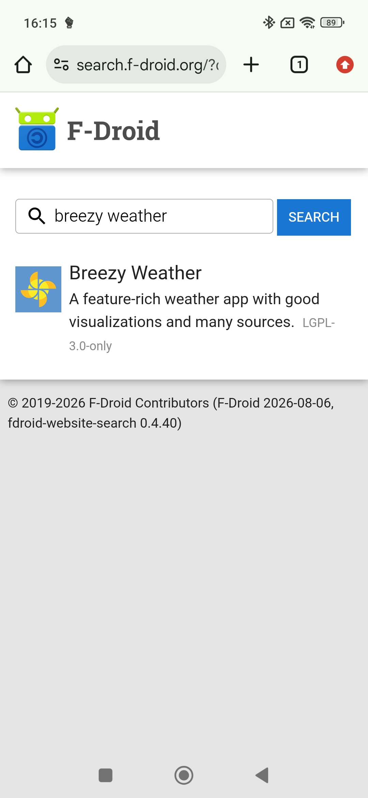

## 天気を取得する地域の設定
アプリを開いたら、`現在地を追加`を押す。

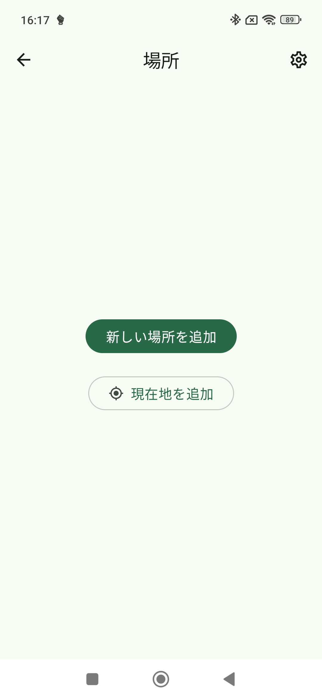

 `気象情報源`の確認画面が出るので、`保存`を押す。

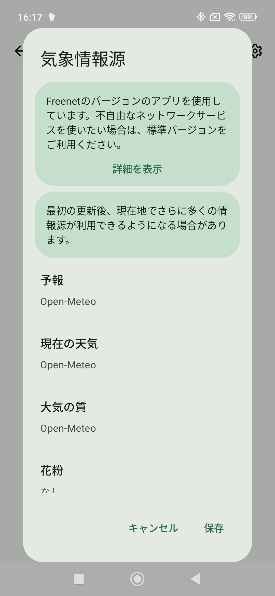

 位置情報へのアクセスを許可する。

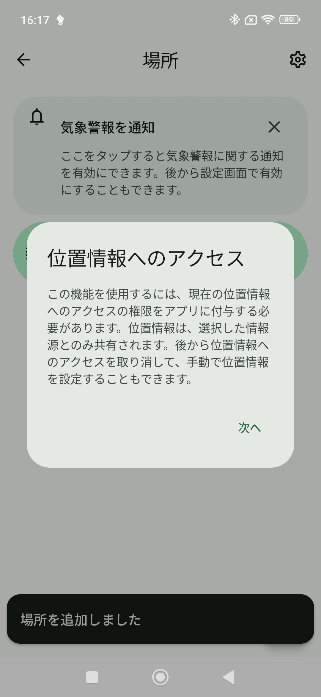 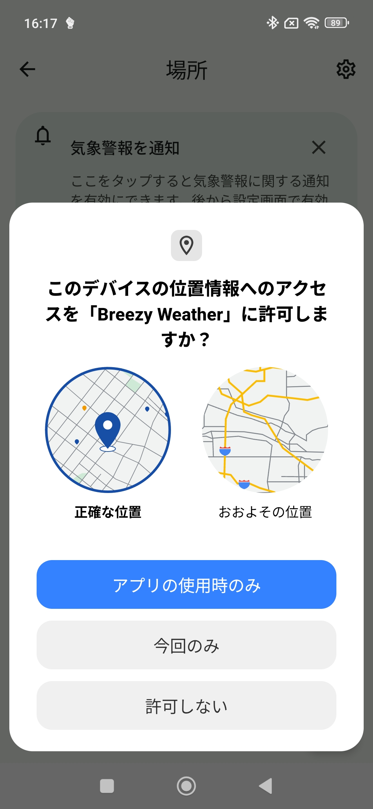

 バックグラウンドでの位置情報アクセスを許可する。

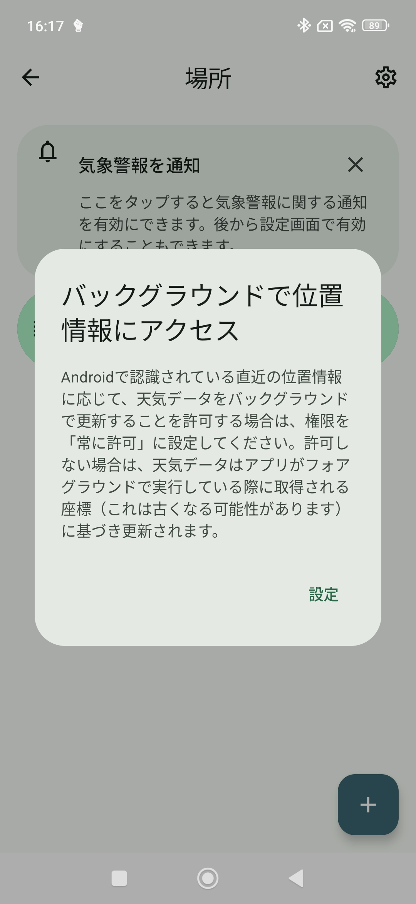 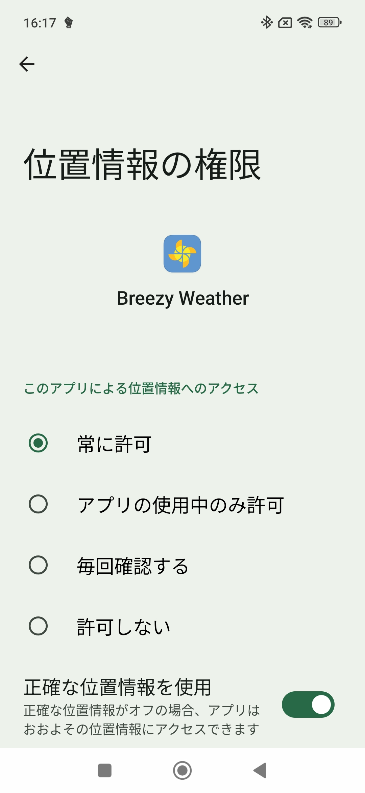

## 天気データをGadgetbridgeで運用する
Breexy Weatherアプリ画面右上の三点マークから、`別のアプリケーションで開く`を選択する。

 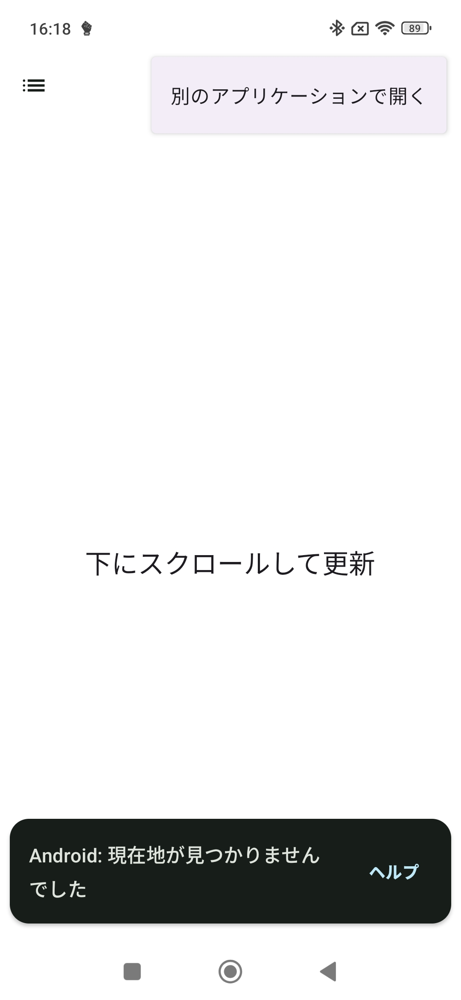

 `アプリで開く`タブに出てくるGadgetbridgeのアイコンを選択し、`常時`に設定する。

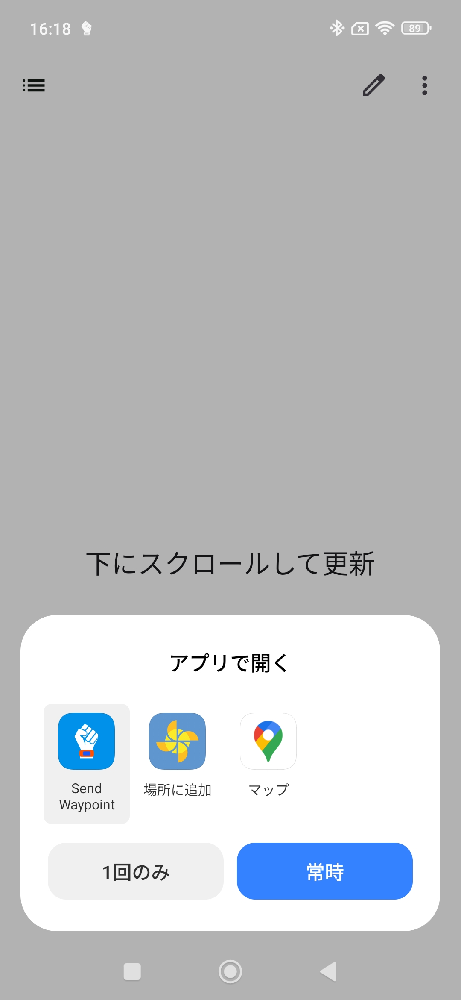

 Gadgetbridgeアプリで、画面左上の三本線のアイコンを押してメニューを開き、`デバッグ`を押す。

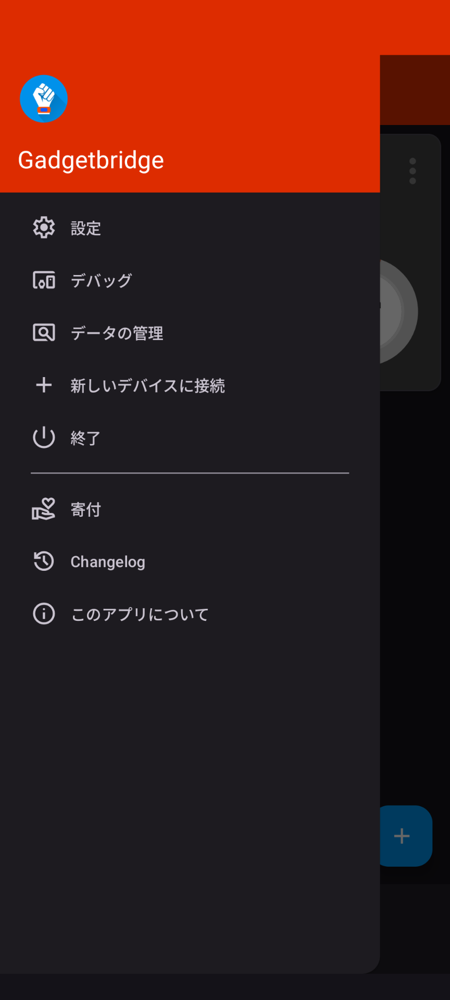

 `天気`を開き、`天気情報をキャッシュする`を有効化する。 `Cache`に地域が表示されたら`Send wheather to devices`を押して、デバイスに情報を反映する。

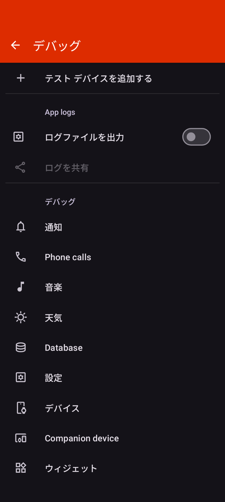 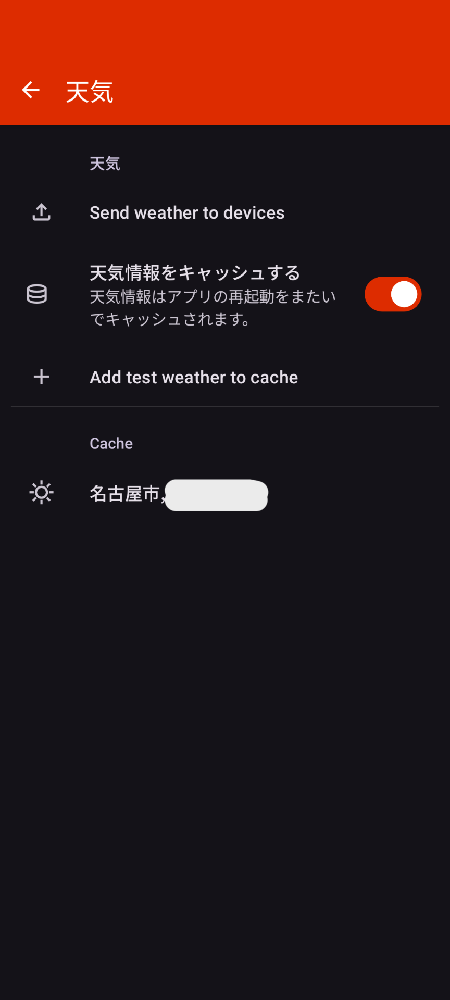 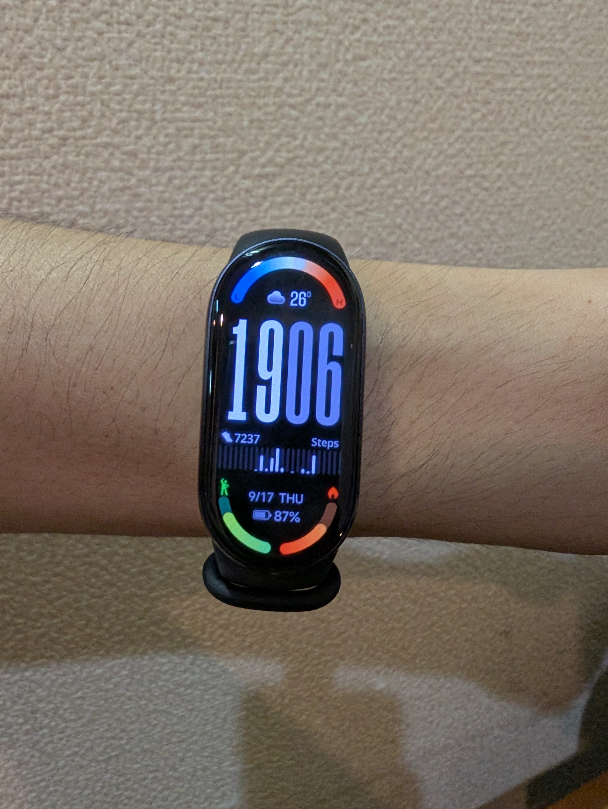

---
**Author: [Chi-robot](https://github.com/G-uruCPQ)** | Date: 2026-09-17
