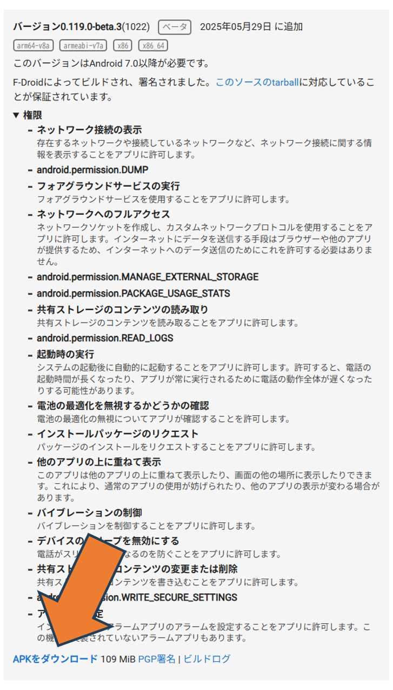

# 創造性開発セミナー 手順書（遠隔バイブレーション）

Arduinoスマートフォンとスマートバンドを活用した遠隔バイブレーションの手順書です。<br>
サンプルコードはありますが、基本的なことしか書いていないので各々で調べて、工夫して様々な機能を追加してください。

## 前提
スマートバンドの接続およびGadget Bridgeの設定は済んでいるものとします。<br>
Gadget Bridgeの許可設定は`Bluetoothコネクト`、`Bluetoothスキャン`、`Fine location`、`Manage Do Not Disturb`、`Post Notification`、`通知をON`あたりが通っていれば問題ないと思います。

## 手順
### 1. [Termux](https://f-droid.org/ja/packages/com.termux/)および[Termux API](https://f-droid.org/ja/packages/com.termux.api/)のインストール
F-DroidからAPKファイルをダウンロードし、それぞれインストール。<br>
F-Droidのアプリはインストールしなくてもよい。<br>
TermuxおよびTermux APIは`スマホの設定`→`アプリからの通知の許可`、`バッテリーセーバーを制限なし`に設定。Gadget Bridgeも設定してない場合は同様に設定。<br>
※ TermuxはGoogle Playストアでも表示されるが、そちらはバージョンが古く、使えない。




### 2. 必要なツールのインストール
Termuxを起動し、vimやnano等のエディタをインストールする。<br>
Pythonもインストールする。

#### 2.1. sshの設定
このままでも操作は可能だが、Pythonコードをスマホで書くのは非常に面倒なので、sshをできるようにすることを推奨。

ssh設定手順（1～4はTermuxで行う）
1. IPアドレスの確認
以下のコマンドを実行して、スマートフォンのwlan0のIPアドレスを調べる。<br>
ssh接続する際に使う。
```bash
ifconfig
```

2. 必要なパッケージのインストール
以下のコマンドをそれぞれ実行してopensshをインストールする。
```bash
pkg update
pkg install openssh
```

3. パスワードの設定
以下のコマンドを実行して、パスワードを設定する。<br>
ssh接続の際に聞かれるので覚えておく。
```bash
passwd
```

4. sshサーバーを起動する
以下のコマンドでsshサーバーを起動する
```bash
sshd
```

5. PCまたはRaspberry piでssh接続する
Termuxのポート番号は22ではなく8022なのでこのように指定して実行する。
```bash
ssh 調べたIPアドレス -p 8022
```
※ この際VScodeのリモートエクスプローラーは使えないのでターミナルや、Ubuntuなどを使う。

### 3. Gadget Bridge操作用サーバーの設計
今回は、スマートフォンをhttpサーバーとして立て、requestを送る形で、Raspberry piやPCからスマートバンドへ疑似通知や疑似通話を送信する設計としています。

httpサーバーを立てるコードをnano等のエディタ作成し、保存する。
- 自力で作成する場合は、Gadget Bridgeで [Intent](https://gadgetbridge.org/internals/automations/intents/)として提供されているコマンドやAPIを確認し、broadcast等の設定を行うことで疑似通知と疑似通話ができる。
- セキュリティを考えた設計にすること。

サンプルコードでは、基本的な機能として疑似通知、疑似通話、短時間通話によるバイブレーションを使えるようにしています。また、通話の発信者も変数として変更可能で、サーバーの一定時間無操作による自動終了も実装しています。<br>各々工夫して活用してください。

<!-- サンプルコードは下にも置きますが、[こちら](https://docs.google.com/document/d/1KWASByS_F0LSJhXfjhWVWcLh2WfnNdByNwla-mRp1g0/edit?tab=t.0)の方がコピペしやすいと思います。 -->

### 4. Raspberry pi側でrequestを送る
Termuxで作成したファイルをpythonで実行し、サーバーを待機状態にさせる。<br>
Raspberry piでpythonコードを作成し、実行することでバイブレーション等を実行させる。

サンプルコードでは、requestにgetでURLを渡し、スマホ側で指定した機能を実行している。いくらでも工夫の余地があるので、頑張って工夫してみてください。

## サンプルコード（スマホ側）
```python:server_for_smartphone_sampla_code.py
import subprocess
import threading
import time
from http.server import BaseHTTPRequestHandler, HTTPServer
import urllib.parse
# ----------------------------------------------------
# 設定：最後のアクセスから何秒放置されたら終了するか (例: 300秒 = 5分)
IDLE_TIMEOUT_SEC = 60
# 最終アクセスの時刻を保持する変数（初期値は現在時刻）
last_access_time = time.time()
server_instance = None
# ----------------------------------------------------
class RequestHandler(BaseHTTPRequestHandler):
  def address_string(self):
    return self.client_address[0]
  def do_GET(self):
    global last_access_time
    # リクエストが来たら最終アクセス時刻を現在に更新（タイマーリセット）
    last_access_time = time.time()
    parsed_path = urllib.parse.urlparse(self.path)
    path = parsed_path.path
    query = urllib.parse.parse_qs(parsed_path.query)
    try:
      if path == "/start":
        caller_name = query.get("caller", ["Raspberry Pi"])[0]
        self.vibrate_start(caller_name)
        self.send_ok(f"Vibration STARTED (Caller: {caller_name})")
      elif path == "/stop":
        self.vibrate_stop()
        self.send_ok("Vibration STOPPED")
      elif path == "/vibrate":
        sec = float(query.get("sec", ["1"][0]))
        caller_name = query.get("caller", ["Raspberry Pi"])[0]
        self.vibrate_start(caller_name)
        time.sleep(sec)
        self.vibrate_stop()
        self.send_ok(f"Vibrated for {sec} seconds")
      elif path == "/notify":
        sender = query.get("sender", ["Wall Entity"])[0]
        body = query.get(
            "body", ["I am living in your walls. You may be concerned..."]
        )[0]
        self.send_notification(sender, body)
        self.send_ok(f"Notification sent from {sender}")
      else:
        self.send_response(404)
        self.end_headers()
    except Exception as e:
      print(f"Error handling request: {e}")
      self.send_response(500)
      self.end_headers()
      self.wfile.write(f"ERROR: {str(e)}\n".encode("utf-8"))
  def vibrate_start(self, caller_name="Raspberry Pi"):
    subprocess.run(
        [
            "am",
            "broadcast",
            "-a",
            "nodomain.freeyourgadget.gadgetbridge.command.DEBUG_INCOMING_CALL",
            "-e",
            "caller",
            caller_name,
            "-p",
            "nodomain.freeyourgadget.gadgetbridge",
        ],
        stdout=subprocess.DEVNULL,
        stderr=subprocess.DEVNULL,
    )
  def vibrate_stop(self):
    subprocess.run(
        [
            "am",
            "broadcast",
            "-a",
            "nodomain.freeyourgadget.gadgetbridge.command.DEBUG_END_CALL",
            "-p",
            "nodomain.freeyourgadget.gadgetbridge",
        ],
        stdout=subprocess.DEVNULL,
        stderr=subprocess.DEVNULL,
    )
  def send_notification(self, sender, body):
    subprocess.run(
        [
            "am",
            "broadcast",
            "-a",
            "nodomain.freeyourgadget.gadgetbridge.command.DEBUG_SEND_NOTIFICATION",
            "-e",
            "type",
            "GENERIC_SMS",
            "-e",
            "phoneNumber",
            "0123456789",
            "-e",
            "sender",
            sender,
            "-e",
            "subject",
            "Alert",
            "-e",
            "body",
            body,
            "-p",
            "nodomain.freeyourgadget.gadgetbridge",
        ],
        stdout=subprocess.DEVNULL,
        stderr=subprocess.DEVNULL,
    )
  def send_ok(self, msg):
    self.send_response(200)
    self.send_header("Content-type", "text/plain; charset=utf-8")
    self.end_headers()
    self.wfile.write(f"OK: {msg}\n".encode("utf-8"))

# 一定時間アクセスがないかを監視するバックグラウンド関数
def idle_watcher():
  global last_access_time, server_instance
  while server_instance:
    time.sleep(10)  # 10秒ごとにチェック
    elapsed = time.time() - last_access_time
    if elapsed > IDLE_TIMEOUT_SEC:
      print(
          f"\n{IDLE_TIMEOUT_SEC}秒間アクセスがなかったため、サーバーを自動終了します。"
      )
      server_instance.shutdown()
      break

if __name__ == "__main__":
  server = HTTPServer(("0.0.0.0", 8080), RequestHandler)
  server_instance = server
  # アイドル監視スレッドをスタート
  watcher_thread = threading.Thread(target=idle_watcher, daemon=True)
  watcher_thread.start()
  print(
      f"Listening on 0.0.0.0:8080... (Auto-shutdown after {IDLE_TIMEOUT_SEC}s"
      " idle)"
  )
  try:
    server.serve_forever()
  except KeyboardInterrupt:
    print("\nManual shutdown...")
  finally:
    server.server_close()
```

## サンプルコード（Raspberry pi側）
```python:samplecode_for_raspberrypi.py
import urllib.parse
import time
import requests

PHONE_URL = "http://{IPアドレス}:{ポート番号}"

# 日本語やスペースを含める場合はエンコードする
sender_name = urllib.parse.quote("ラズパイ監視システム")
message_body = urllib.parse.quote("居眠りを検知しました。起きろ。")
caller_name = urllib.parse.quote("さぼり検知マン")

# 通知を送る
requests.get(f"{PHONE_URL}/notify?sender={sender_name}&body={message_body}")

time.sleep(1)
#疑似電話（発信者名初期設定）
requests.get(f"{PHONE_URL}/start")

time.sleep(10)

requests.get(f"{PHONE_URL}/stop")

#疑似電話（発信者名変更）
requests.get(f"{PHONE_URL}/start?caller={caller_name}") 
```
